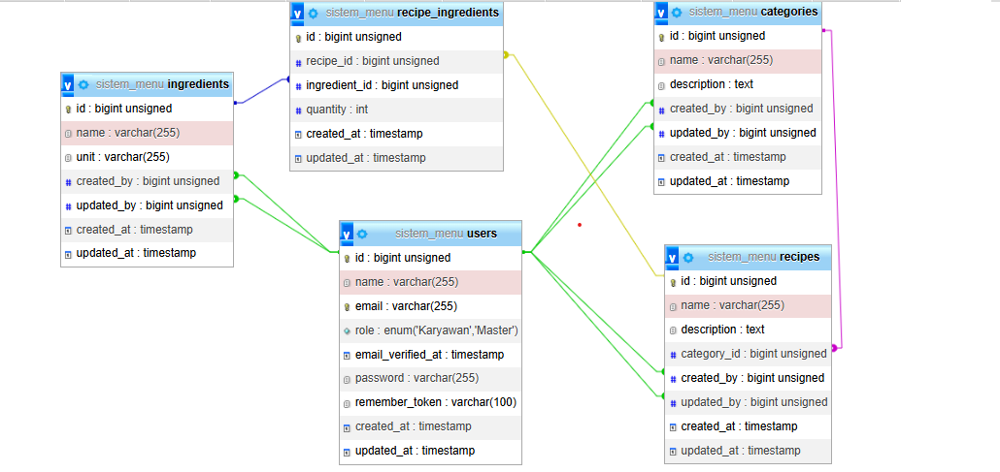

# AppBahan - Aplikasi Manajemen Resep Kuliner

AppBahan adalah aplikasi berbasis web untuk membantu Anda mengelola resep kuliner, bahan-bahan, dan kategori dengan mudah. Cocok untuk bisnis makanan atau penggunaan pribadi.


## Akun Contoh
Untuk memudahkan pengujian, berikut adalah akun default:

1. **Akun Master**
   - Email: `master@example.com`
   - Password: `password123`
   - Role: Master (akses penuh)

2. **Akun Karyawan**
   - Email: `karyawan@example.com`
   - Password: `password123`
   - Role: Karyawan (akses terbatas)

## Fitur Utama

1. **Manajemen Kategori**
   Tambahkan dan kelola kategori seperti *Makanan Berat*, *Makanan Ringan*, dan *Minuman*.

2. **Manajemen Bahan**
   Atur daftar bahan yang dapat digunakan dalam berbagai resep.

3. **Manajemen Resep**
   Buat resep lengkap dengan deskripsi, kategori, dan bahan.

4. **Seeder Otomatis**
   Isi database dengan data dummy untuk memulai lebih cepat.

5. **Unit Testing**
   Pastikan aplikasi berjalan sesuai harapan dengan pengujian otomatis.

---

## Instalasi

Ikuti langkah-langkah berikut untuk menjalankan BaksoApp di lokal Anda.

1. Clone repository ini:
```bash
git clone https://github.com/jofan-cah/sistem-menu.git
cd sistem-menu
```

2. Install dependensi Composer:
```bash
composer install
```

3. Salin file environment:
```bash
cp .env.example .env
```

4. Generate app key:
```bash
php artisan key:generate
```

```bash
php artisan storage:link
```

5. Konfigurasi database di file `.env`:
```
Sesuaikan jika ana ingin mengunkan databse yang tidak sama dengan contoh
```

6. Jalankan migrasi database:
```bash
php artisan migrate
```

7. Isi database dengan data awal:
```bash
php artisan db:seed
```

8. Instal dan kompilasi asset frontend:
```bash
npm install
npm run dev
```

9. Jalankan server pengembangan:
```bash
php artisan serve
```

## Menjalankan Pengujian

Pastikan aplikasi berfungsi dengan baik menggunakan pengujian otomatis:
```bash
php artisan test
```

## Kontribusi

1. Fork repository
2. Buat branch fitur baru
3. Commit perubahan Anda
4. Push ke branch
5. Buat Pull Request

## Teknologi yang Digunakan

- Laravel 11.x
- MySQL
- Bootstrap
- Laravel Breeze

## Lisensi

FREE USE

# Gambar ERD



# Gambar Flowchart
